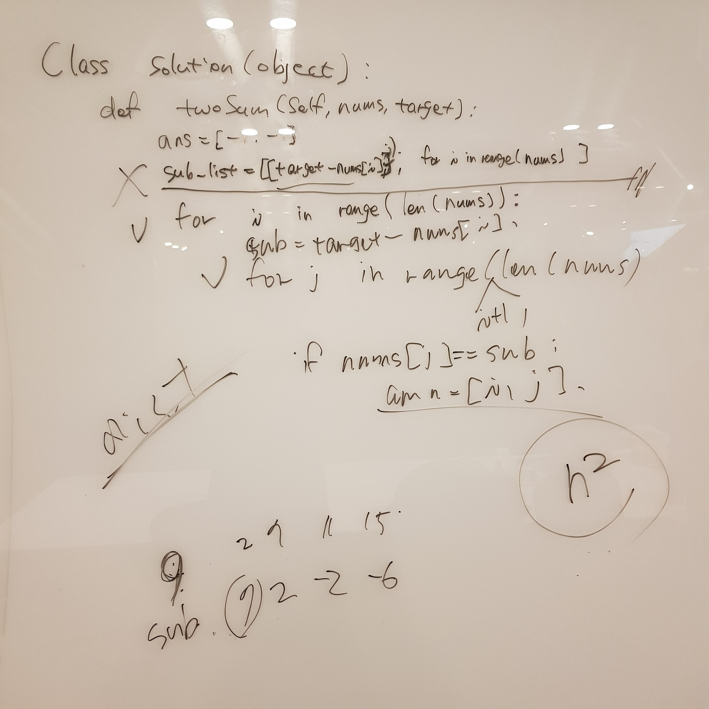
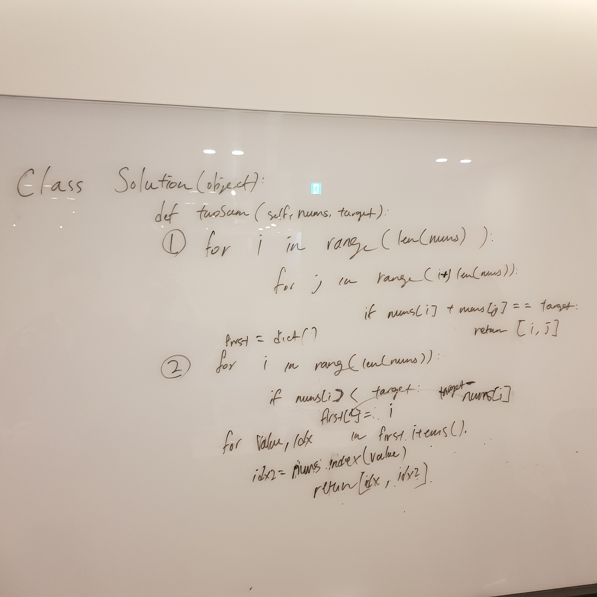

# 1. Two Sum

출제자: 케빈

[Link](https://leetcode.com/problems/two-sum/)

- 출제 이유
  - LeetCode 내에서 가장 유명한 문제 중 하나! 첫 시작으로 적절해 보였다 ㅎ.ㅎ
  - 단순하게 풀려면 아주 쉽게 풀 수 있지만, 조금 최적화를 하려면 그리 쉽게 생각나지는 않는다
  - 많은 알고리즘 문제들에서 쓰이는 **메모**의 첫 활용법!

## Damian

- 문제 풀이
  - input으로 주어진 nums 배열을 이용해 <값, nums의 index>를 entry로 하는 맵(inverted)을 만든다.
  - 다시 nums 배열을 순회하며 원하는 값이 있는지 확인하고 그 값이 있으면 결과를 반환한다.
  - nums 배열을 한 번 순회하였는데 답을 찾지 못하였을 경우 문제가 잘못된 것이기 때문에 예외를 던진다.
  - 복잡도
    - 시간 복잡도: O(n)
    - 공간 복잡도: O(n)
- 아쉬운 점
  - 엣지 케이스를 고려하지 못 했다. 두 번째 nums 배열을 다시 순회하며 답을 찾을 때 자기 자신과 같은 경우는 제외해주어야 했다. 
  - 한 번만 순회하며 풀 수도 있었는데 그러지 못해 아쉽다. 
---

## Stella


---

## Tess


---

## Latte


---

## Kevin

가장 단순하게 푸는 방법은 brute force하게 하나 하나 다 도는 것이다!!

```kotlin
fun twoSum(nums: IntArray, target: Int): IntArray {
    for (i in 0.until(nums.size)) {
        for (j in (i + 1).until(nums.size)) {
            if (nums[i] + nums[j] == target) {
                return intArrayOf(i, j)
            }
        }
    }

    return intArrayOf()
}
```

요로케 풀면 space complexity는 **O(1)**이지만 time complexity는 **O(n^2)**이다.

이럴 때 흔히 쓸 수 있는 방법이 space complexity를 희생해서 time complexity를 최적화하는 것인데, **map을 사용해서 지나간 숫자들을 메모해 두는 것이다**.

```kotlin
fun twoSum(nums: IntArray, target: Int): IntArray {
    val memo = hashMapOf<Int, Int>()
    for (i in 0.until(nums.size)) {
        val complement = target - nums[i]
        if (complement in memo) {
            // 메모에 complement가 있으면 해답을 찾은 것이다
            return intArrayOf(memo[complement]!!, i)
        } else {
            // 없으면 현재 숫자와 인덱스를 메모에 추가해두도록 한다
            memo[nums[i]] = i
        }
    }
    return intArrayOf()
}
```
