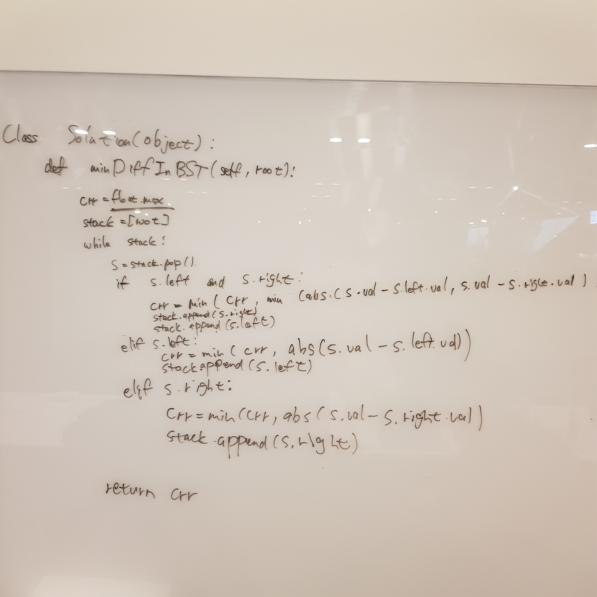

# 783. Minimum Distance Between BST Nodes

[Link](https://leetcode.com/problems/minimum-distance-between-bst-nodes/)

- 출제 이유
  - Binary Search Tree를 이해하고 있는지 보는 것
  - Tree를 traversal 하는 방법을 이해하고 있는 지 보는 것
    - Recursive
    - Iteratively

## Kevin


- Time Complexity: O(n)
- Space Complexity: O(n)

- Binary Search Tree라는 자료구조 자체를 너무 오랜만에 접해서 첫 시도때는 그냥 현재 값과 direct left/right의 값만 비교했다. 그랬더니 데미안이 '이런 말도안되는!'이라는 표정을 지어서 다시 생각해봤다.
- BST의 특성상 현재 값과 가장 가까운 값은 direct child가 아닌 가장 하위의 child가 된다. Inorder traversal이라는 방식을 써서 돌면 트리의 값들을 오름차순으로 쿼리할 수 있다. 따라서 queue를 하나 두고 오름차순으로 queue에 아이템들을 넣으면, 그 다음은 단순하게 하나씩 돌면서 가장 작은 차이값을 얻어내면 되므로, 고런 식으로 다시 구현했다.
- Inorder traversal을 recursive하게 구현했는데, 이마저도 오랜만에 해봐서 좀 헤맸다. 이걸 만약 iterative로 바꾸라고 하면 지금은 못할 것 같다...

---

## Stella


---

## Tess


- 기존에 풀던 문제들의 입력값과 달라서 시행착오가 많았다. 이번 기회에 이런 형식에 익숙해질 것.

```python
class Solution(object):
    def minDiffInBST(self, root):
        mymin = 1e9
        prev = None
        curr = root
        start = []
        while curr or start:
            while curr:
                start.append(curr)
                curr = curr.left
                
            curr = start.pop()
            
            if prev != None:
                mymin = min(mymin, abs(curr.val - prev.val))
                
            prev = curr
            curr = curr.right
            
        return mymin
```

---

## Latte


---

## Damian
- 의도했던 풀이
  - Binary Search Tree의 노드를 inorder traversal 한다.
    - BST를 inorder traversal 하는 것은 정렬된 배열을 앞에서부터 순차적으로 접근하는 것과 같다.
  - 이전에 방문했던 노드의 값을 기억한다. 그리고 그 값과 현재 값의 차이를 구한다. 이 값이 현재 최소값보다 작은 경우 최소값을 업데이트 한다.
- Recursively

```java
private TreeNode previous = null;

private int min = Integer.MAX_VALUE;

public int minDiffInBST(TreeNode root) {
    findMinDiffInBST(root);
    return min;
}

private void findMinDiffInBST(TreeNode root) {
    if (root == null) {
        return;
    }
    findMinDiffInBST(root.left);
    if (previous != null) {
        min = Math.min(min, root.val - previous.val);
    }
    previous = root;
    findMinDiffInBST(root.right);
}
```


- Iteratively

```java
public int minDiffInBST(TreeNode root) {
    Deque<TreeNode> stack = new LinkedList<>();
    TreeNode previous = null;
    TreeNode current = root;
    int min = Integer.MAX_VALUE;
    while (current != null || !stack.isEmpty()) {
        while (current != null) {
            stack.push(current);
            current = current.left;
        }
        current = stack.pop();
        if (previous != null) {
            min = Math.min(min, current.val - previous.val);
        }
        previous = current;
        current = current.right;
    }
    return min;
}
```

