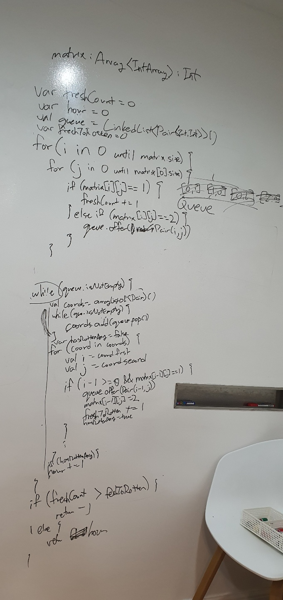

# 994. Rotting Oranges

출제자: 라떼

[문제 - Rotten Oranges ](https://leetcode.com/problems/rotting-oranges/)

- 출제 이유
  - 약간 어려운 문제로 골랐다. 엣지 케이스를 고려해야할 것이 좀 있는 친구로!

## Kevin


- 처음에 설명을 다 들었을땐 막막했다. **아니 내가 이걸 어케하냐구!!** 하면서 고민이었는데 갑자기 어라? 새로 rotten 된 애들만 알고 있으면 그 다음에 또 퍼트리고 퍼트리고.. 하면 되는거 아닐까? 해서 Queue가 떠올랐다.
- Queue에 넣어야 한다는걸 알고 난 후에는 나름 술술 생각이 풀렸다. 아무래도 라떼가 크게 **그렇죠!!** 라고 해줘서 자신감이 붙었나보다.
- 하지만 아래에 라떼가 적어줬듯이 카운터를 증가시키는 로직에 있는 구멍을... 라떼가 계속 언급했음에도 불구하고 난 고집을 굽히지 않았다 ㅋㅋㅋㅋㅋㅋㅋㅋ. '맞는거 같은데?' 라는 생각이 한번 박히니까 안보이더라구 흠흠... **이젠 출제자의 말을 아주 높이 신뢰해야겠다**.
- 라떼도 말해줬듯이 쓰고 나서 보니까 불필요한 변수들이 있었다. 예를 들어 나는 ```freshCount```와 ```freshToRotten``` 두 개를 두고 마지막에 이 두 개의 값을 비교했는데, 단순히 ```freshCount```만 쓰는 방향으로 해도 무관하다. 내 생각에 요런건 로직을 다 짜고 시간이 남으면 정리해가면 될 듯 하다.
- 오!! 동서남북 비교할때 라떼가 적은 array 하나 만들어서 하면 편리하겠거니 하다는걸 배웠다.
- 라떼 인터뷰어 역할 잘한다.

---
## Tess

```python
class Solution(object):
    def orangesRotting(self, grid):
        Y = len(grid)
        X = len(grid[0])
        rotten = []
        fresh = 0
        for y in range(Y):
            for x in range(X):
                if grid[y][x] == 2:
                    rotten += [(y, x)]
                if grid[y][x] == 1:
                    fresh += 1

        time = 0
        if not fresh and rotten or not fresh and not rotten: return time

        while rotten and fresh:  # 2만 있는 경우도 존재해서 fresh가 있고, 2가 있는 경우로 조건을 바꿔줘야 한다.
            time += 1
            for _ in range(len(rotten)):
                ry, rx = rotten.pop(0)
                for dy, dx in [(0, 1), (0, -1), (1, 0), (-1, 0)]:
                    iy, ix = dy + ry, dx + rx
                    if 0 <= iy < Y and 0 <= ix < X and grid[iy][ix] == 1:
                        grid[iy][ix] = 2
                        fresh -= 1
                        rotten += [(iy, ix)]
                        if fresh == 0:
                            return time
        if fresh != 0:
            return -1
```

- 예전에 백준에서 썩은토마토 라는 비슷한 문제를 푼 적이 있었다!
- 케빈이 바로 바로 풀어가는 걸 보면서 엄청 대단하다고 느꼈고, 라떼가 면접관 역할을 정말 잘 소화해낸다는 것도 알게되었다.
- `나보다 면접관을 믿자!`

---

## Latte


```kotlin
fun orangesRotting(grid: Array<IntArray>): Int {
    var freshOranges = 0
    val rotQueue: Queue<Int> = ArrayDeque()
    val row = grid.size
    val column = grid[0].size
    var time = 0

    for (r in 0 until row) {
        for (c in 0 until column) {
            if (grid[r][c] == 2) {
                rotQueue.add(r * column + c)
            }
            if (grid[r][c] == 1) {
                freshOranges++
            }
        }
    }

    val dirs = arrayOf(intArrayOf(0,1),intArrayOf(0,-1),intArrayOf(1,0),intArrayOf(-1,0))
    while (freshOranges !=0 && rotQueue.isNotEmpty()) {
        for( i in 0 until rotQueue.size){
            val curr = rotQueue.poll()

            for(dir in dirs) {
                val r = curr / column + dir[0]
                val c = curr % column + dir[1]

                if(r in 0 until row && c in 0 until column && grid[r][c] == 1){
                    grid[r][c] = 2
                    rotQueue.add(r* column + c)
                    freshOranges--
                }
            }
        }

        time++
    }

    return if(freshOranges == 0) time else -1
}
```

문제를 보면 BFS형태로 풀어야겠다는 생각이 먼저 드는데, 케빈도 금방 queue를 활용해야겠다는 생각에 접근해서 놀랬다. 이 문제는 여러 가지 엣지케이스를 고려해야하는데
1. 시간 값을 잘 구할 수 있는지 (마지막에 +1하기 쉽다)
2. 안썩은 오렌지가 남았는지
3. 0,1,2가 각각 1개씩 들어왔을 때 잘 처리하는지.

케빈은 1번을 제외한 코드를 한 번에 짜서 생각보다 금방해결 할 수 있던 것같다. 특히 FreshOranges를 카운팅한다는 생각이 빠르게 들어서 놀랬다.

> 케빈이 프로그래밍하면서 누락한 1번 케이스에 대해서 조언할 때 쉽게 받아들이지 못하는걸 보고 나도 조심해야겠다고 느꼈다. 이제서야 지니가 이전에 한 말이 공감이 되었다!
