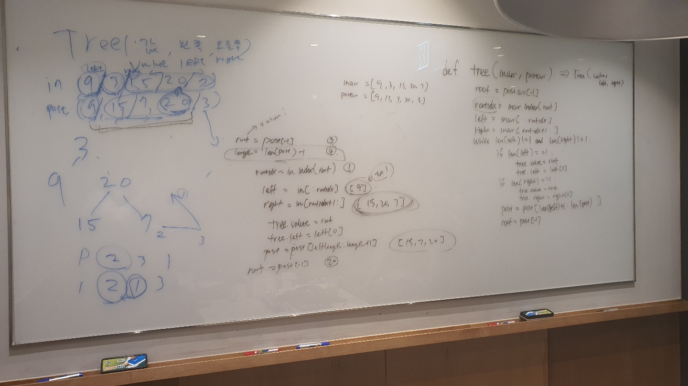

# 106. Construct Binary Tree from Inorder and Postorder Traversal

출제자: 라떼

[문제 - Construct Binary Tree from Inorder and Postorder Traversal ](https://leetcode.com/problems/construct-binary-tree-from-inorder-and-postorder-traversal/)

- 출제 이유
  - 트리 구조와 inorderTraversal과 postorderTraversal에 대한 이해도에 대한 문제로 까다로운 문제와 복잡한 로직을 놓침없이 구현해 내야해서 난이도가 어려운 문제가 된다.

## Tess


- 재귀로 접근해야하는 걸 알면서도 손코딩으로 재귀를 짜는게 너무 낯설었다고 해야하나..
- leetcode에서 tree를 반환하는 리스트의 모양은 아래 링크에서 확인가능하다.

https://support.leetcode.com/hc/en-us/articles/360011883654-What-does-1-null-2-3-mean-in-binary-tree-representation-

보면, [현재, 현재의 left, 현재의 right] 순으로 tree가 그려지는걸 확인 할 수 있었다.

```python
    '''
    이 문제에서 TreeNode(3)을 하면,
    TreeNode{val: 3, left: None, right: None}이라는 객체가 나오는데,
    이런 객체의 left와 right를 채워주면 되는 문제였다.
    root = TreeNode(3)을 해서
    가져온다음에 root.left, root.right에 해당하는 것을 채워준다.
    '''
    
# Definition for a binary tree node.
# class TreeNode(object):
#     def __init__(self, x):
#         self.val = x
#         self.left = None
#         self.right = None

class Solution(object):
    def buildTree(self, inorder, postorder):
        """
        :type inorder: List[int]
        :type postorder: List[int]
        :rtype: TreeNode
        """ 
        length = len(inorder)
        if length: # 예외처리
            val = postorder[-1]
            root = TreeNode(val)
            if length > 1:
                cut  = inorder.index(val)
                root.left = self.buildTree(inorder[:cut], postorder[:cut])
                root.right = self.buildTree(inorder[cut+1:], postorder[cut:-1])
            return root
```

- recursive하게 접근한다.
- 이때 `inorder`와 `postorder`가 빈 리스트들로 들어오는 경우가 있기 때문에 예외처리를 한 번 해준다. ([], [])
- inorder traversal (중위순회) 의 경우 아래와 같이 순회한다.
  - 왼쪽 - 현재 - 오른쪽
- postorder traversal (후위순회) 의 경우 아래와 같이 순회한다.
  - 왼쪽 - 오른쪽 - 현재

이러한 특징을 보았을때, postorder에 들어가있는 값중 가장 맨 뒤의 값이 최상위 root임을 알 수 있다. 

Inorder.index(val)을 해서 자르는 부분을 매번 찾는건 시간복잡도가 올라갈 것 같아서 따로 dictionary에 저장하고 싶었다. 개선된 코드도 생각해봐야지.

> 라떼가 엄청 엄청 친절하게 잘 설명해줬었는데! 정말 정말 고마웠다. 열심히 할게요! 

---

## Kevin

- 뒤에서 보면서 어려운 문제라는 생각은 들었는데, 테쓰가 고생은 했지만 유의미한 시간이었다고 생각한다. 뭔가 테쓰의 신발에 들어가보니 **나같으면 마음 속으로 이미 포기하고 있었을거라 생각**되는데, 그럴 때 난 어떻게 해야할까 라는 생각도 들었다. 이런 상황에 대한 경험은 꼭 코딩 면접이 아니더라도 어디에나 도움되지 않을까?
- 라떼가 설명을 되게 잘해줬다. 그래서 어떻게 접근해야할지 감은 오는데 **그걸 코드로 어케써야할지 정말 감이 잘 안왔다**. 근데 사실 혼자 알고리즘 공부할때는 이런 류의 문제도 풀 수 있었던거 같거든? ㅋㅋㅋㅋㅋ 근데 바로 그 현장에 있어서 그런지.. 머리가 잘 안 돌아갔던거 같고 테쓰는 더더욱 그랬을거 같다.
- **한 번 코드를 작성해가기 시작하면 거기에 계속 빠져든다는걸 다시 느꼈다**. 가능할진 몰겠지만, 코드 자체를 쓰기 전에 로직을 한번 옆에 쓴 후에 코드를 작성해볼까 싶다. 연습할때 그렇게 해봐야지.

---

## Latte


```kotlin
//solution ver1 with lists

class Solution {
    fun buildTree(inorder: IntArray, postorder: IntArray): TreeNode? {
        return recurs(postorder.reversedArray().toList(), inorder.toList())
    }

    fun recurs(revPost: List<Int>, inorder: List<Int>): TreeNode? {
        if (inorder.isEmpty()) return null

        val root = TreeNode(revPost[0])
        val rootIndex = inorder.indexOf(revPost[0])

        root.left = recurs(
            revPost.slice(revPost.size - rootIndex until revPost.size)
            , inorder.slice(0 until rootIndex)
        )
        root.right = recurs(
            revPost.slice(1 until revPost.size - rootIndex)
            , inorder.slice(rootIndex + 1 until inorder.size)
        )
        return root
    }
}

```

---


```kotlin
//solution ver2 with indexes

class Solution {
    fun buildTree(inorder: IntArray, postorder: IntArray): TreeNode? {
        inorder.mapIndexed{ index, value -> inMap[value] = index}
        return recursive(postorder.reversedArray(), inorder, 0, 0, inorder.size - 1)
    }

    fun recursive(revPost: IntArray,
                  inorder: IntArray,
                  postIndex: Int,
                  inStart: Int,
                  inEnd:Int): TreeNode? {

        if (inStart > inEnd) return null
        val root = TreeNode(revPost[postIndex])
        val rootIndex = inMap[root.`val`]!!
        // Note this is where ordering is flipped from the previous problem
        root.right = recursive(revPost, inorder, postIndex + 1, rootIndex + 1, inEnd)
        root.left = recursive(revPost, inorder, postIndex + inEnd - rootIndex + 1, inStart, rootIndex - 1)
        return root
    }
}
```

이 문제를 풀 땐 우선 inorder / postorder에 대한 리스트를보고 룰을 찾아내는 것이 가장 선결과제이다. 이런 유형은 처음풀어보는데 추후에 비슷한 문제에 도움이 될 것같다.

다음은 리스트를 활용해서 문제를 풀어가는 방법에 대한 가이드이다.

1.  inorder 방식으로 정렬된 리스트에는 왼쪽 노드리스트 / 루트 / 오른쪽 노드리스트 형식으로 도입된다.
2. postorder 방식으로 정렬된 리스트는 왼쪽 노드리스트 / 오른쪽 노드 리스트 / 루트 형식으로 도입된다.
3. 주어진 리스트들에서 postorder에서 마지막값으로 루트를 삼고, 그 값이 inorder에서 어디에 있는지 인덱스를 찾는다.
4. inorder에서 루트 왼쪽을 leftInorder로 짜르고 루트 오른쪽을 rightInorder로 짜른다.
5. post와 in은 사이즈가 같으므로 같은 사이즈 만큼 left를 짜른다. 나머지를 right로 짜른다.
6. 재귀를 통해 3번부터의 행위를 반복한다.
7. 결과를 반환한다.

밑에 최적화된 코드는 index를 활용해서 위의 로직을 재해석하도록 된 문제다.

실제로 면접에서 처음 맞이했으면 문제 풀기 쉽지 않았을 것같았고, 테쓰가 고생을 많이했다. 인터뷰이가 모르는 문제를 맞닥드렸을 때 조금 더 적극적으로 인터뷰어에게 질문을 하면 좋을 것같다. 

음.. 문제를 실제로 못풀더라도 커뮤니케이션능력이나 적극성을 어필할 순 있을 것같다. **면접관을 같이 협업하는 시니어 동료라고 가정하고** 도움을 구하면서 문제를 해결해나가는 스탠스가 가장 좋은 것같다.


> 앉아서 문제 풀 때보다 어려워진다는 점을 인지 못하고 어려운 문제를 그대로 가져왔다. 이 또한 좋은 경험이라면 좋은 경험인데, 지금 시기엔 어려웠던 것같다. 테쓰 미안해오 ㅠㅠ
