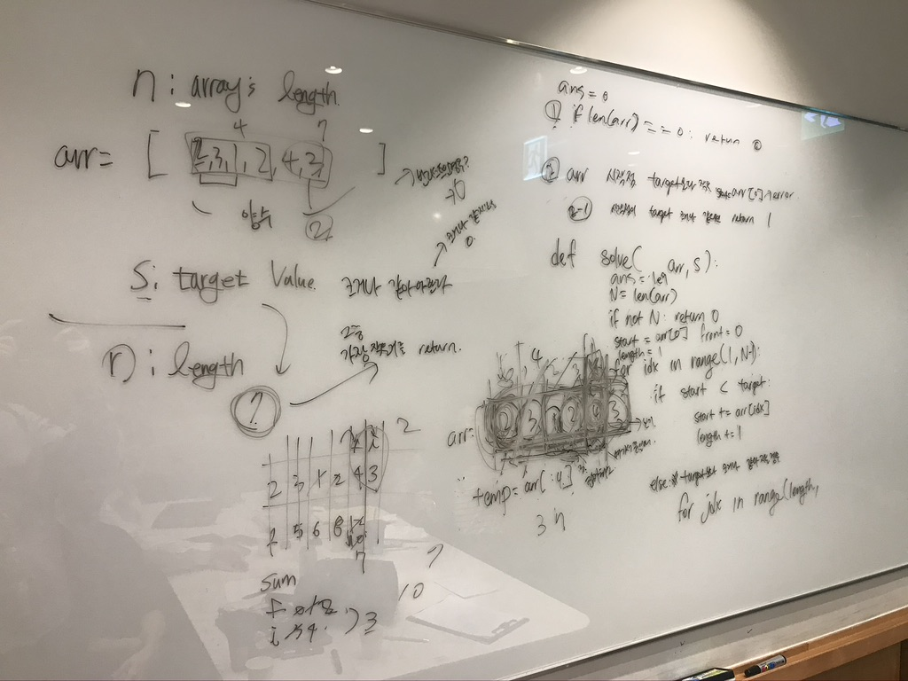

# 209. Minimum Size Subarray Sum

출제자: Damian

[Minimum Size Subarray Sum](https://leetcode.com/problems/minimum-size-subarray-sum/)

- 출제 이유
  - array 관련 문제를 풀 때 여러 개의 pointer를 두고 그 pointer를 조작하며 풀면 비교적 간단히 풀리는 문제가 많다. 이 문제도 그런 유형의 문제라 생각했고 연습하기 좋을 것 같았다.
  - 면접관에게 질문을 통해 많은 걸 얻기 좋은 문제라고 생각했다.

---

## Tess


- mysum에 for문을 돌면서 쭉 더해나가면서 s보다 같거나 커지면 앞에서부터 pin(앞에서부터) 빼고 뺀 개수를 저장해준다.
- 앞에서 풀다보면 진짜 아무생각이 안나는 경우가 있는데, 언제쯤 익숙해지 고민이다.
- 평소에도 면접을 보는 상태라고 생각하고 풀어야겠다.
- 더 고민해보고 더 최적화한 풀이를 올려야지!

```python
class Solution(object):
    def minSubArrayLen(self, s, nums):
        if nums == []: return 0
        mysum = 0
        pin = 0
        N = len(nums)
        mylength = 1e9
        templength = 1
        for idx in range(N):
            mysum += nums[idx]
            templength += 1
            if mysum >= s and mylength > templength:
                print(templength)
                mylength = templength
            
            while mysum >= s:
                mysum -= nums[pin]
                pin += 1
                print(mysum, templength)
                if mysum >= s and mylength > templength:
                    mylength = templength
                templength -= 1
                if mysum <= s:
                    if mylength > templength:
                        mylength = templength
        if mylength == 1e9: return 0
        return mylength
```


---

## Damian

- 문제를 설명하는 부분, 중간에 힌트를 주는 부분에서 버벅임이 있었다. 최대한 말로 문제를 설명하고 함수를 어떻게 정의하는지 부터 보고 싶었으나 의도한 바대로 되지 않았다.
- 중간에 테쓰가 다른 테스트 케이스가 혹시 있는지 물어보았을 때 마땅한 예시를 주지 못 했다. 앞으로는 문제를 준비할 때 실패, 성공, 엣지 케이스 등 여러 개의 예시를 미리 준비해두어야 겠다. 막상 진행 중에 떠올리려 하니 실수할까봐 잘 안 됐다.
- 이 문제도 역시나 다양한 풀이 방법이 존재한다. 그러나 여러 풀이 방법 중 여러 개의 pointer를 이용하는 방법이 가장 직관적이라고 생각한다. 아래는 그 풀이 방법의 예시이다.

```java
public int minSubArrayLen(int s, int[] nums) {
    if (nums == null || nums.length == 0) {
        return 0;
    }
    
    int start = 0;
    int end = 0;
    int currentSum = 0;
    int minLength = Integer.MAX_VALUE;
    
    for (int i = 0; i < nums.length; i++) {
        end = i;
        currentSum += nums[i];
        
        while ((currentSum - nums[start]) >= s) {
            currentSum -= nums[start++];
        }
        
        if (currentSum >= s) {
            minLength = Math.min(minLength, end - start + 1);
        }
    }
    return currentSum >= s ? minLength : 0;
}

```
