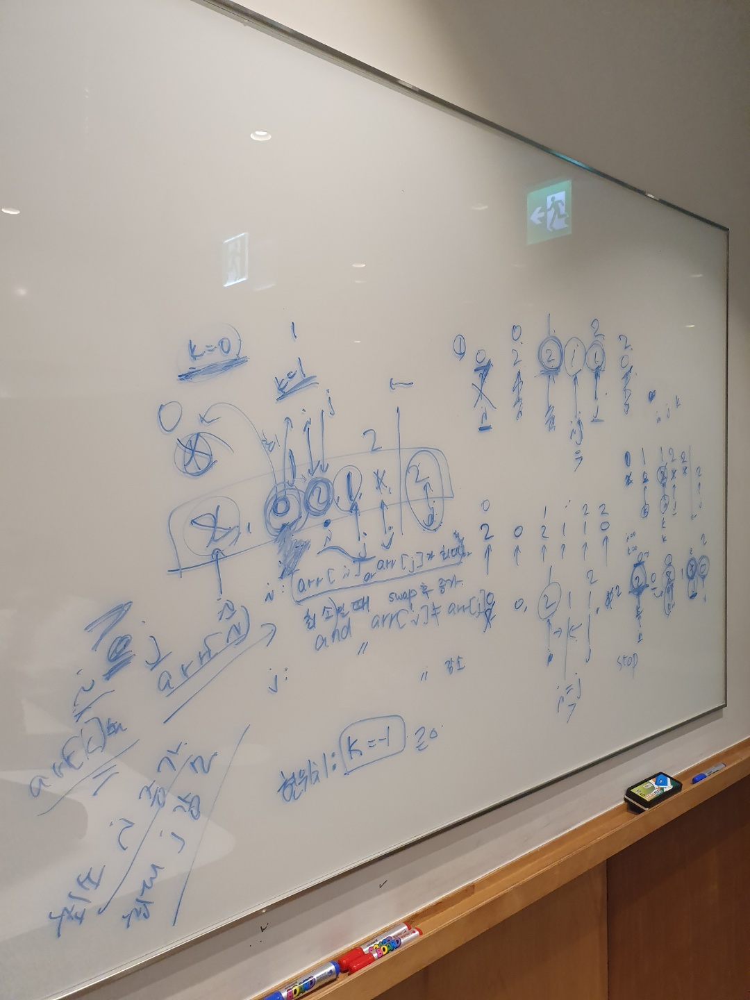
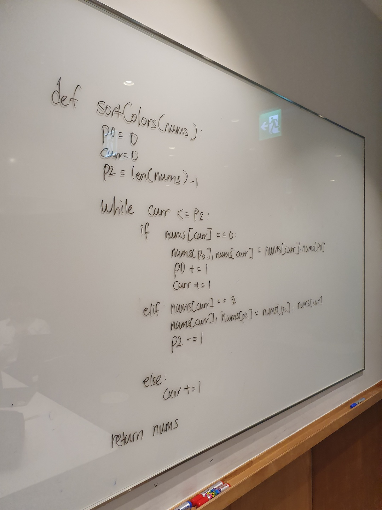

# 75. Sort Colors

출제자: Tess

[Sort Colors](https://leetcode.com/problems/sort-colors/)

- 출제 이유
  - 문제를 풀었을때, 조건 주는 연습하기 좋은 문제라고 생각되어서 출제하게 되었다!
  - 이런 형식의 문제를 면대면으로 풀게되면 긴장되어서 시간이 많이 걸릴 것 같다 ㅠㅠ

---

## Stella



- 모의 인터뷰 자리에서는 풀이 방법이 도저히 생각나지 않았다. 돌아와서 다시 풀면서도 4번째 submit 에서야 겨우 문제를 풀 수 있었다. 이런 류의 문제를 더 많이 연습해봐야겠다.
- 내가 문제를 풀때에 한번에 풀리지 않으면 포기해버리는 습관이 있다는걸 알게됐다. 라떼가 하듯이 어떻게든 풀어내는 근성(?)을 좀 가져봐야겠다.
- pt0과 pt2를 각각 0이 보이면 바꿀 자리, 2가 보이면 바꿀 자리로 놓고 풀면 잘 풀렸다. 아래는 다시 생각해서 푼 코드다.
```python
class Solution(object):
    def sortColors(self, nums):
        """
        :type nums: List[int]
        :rtype: None Do not return anything, modify nums in-place instead.
        """
        pt0=0
        pt2=len(nums)-1
        curr=0
        while curr <= pt2:
            if nums[pt2]==2:
                pt2-=1
            elif nums[curr]==0:
                nums[pt0], nums[curr]=nums[curr], nums[pt0]
                pt0+=1
                curr+=1
            elif nums[curr]==1:
                if pt0 <0:
                    pt0=curr
                curr+=1
            elif nums[curr]==2:
                nums[curr], nums[pt2]=nums[pt2], nums[curr]
                pt2-=1
        return nums
```

## Kevin

- 엘리먼트가 0, 1, 2라는 한정적인 애들로만 이루어져 있으니 맨 처음 떠올렸던건 bucket sort였는데, extra memory를 안쓰는것이 최적의 솔루션이라고 해서 차단당했다.
- 결국 여기서 소개한 가장 최적의 솔루션은 포인터 여러개를 갖다가 이리저리 하는건데, 하.. 이것도 마찬가지로 혼자 생각하면서 하면 꽤나 잘 했을 터인데 나도 앞에 나가서 했으면 당황해서 못했을것이다 ㅠ
- 어떻게해야 말하면서 푸는 것에 익숙해질까? 연습이 답인가 ㅎ.ㅎ

---

## Tess



- 문제를 고르면서 저번에 데이안이 했던 것처럼 팔로업 질문을 준비해가려고 했는데,
- 문제가 문제이다보니 딱히 알고리즘을 물어볼게 없었다!
- 이런 유형의 문제는 많이 접해보는게 최선인 것 같기도 하구..!
- counting sort를 대놓고 쓰지 말라고 적혀있어서..ㅎㅎ
- 최적의 솔루션이 진짜로 더 빠른게 맞나? 라는 이야기가 있었는데, 그 부분에 대해서도 생각해봐야겠다.
