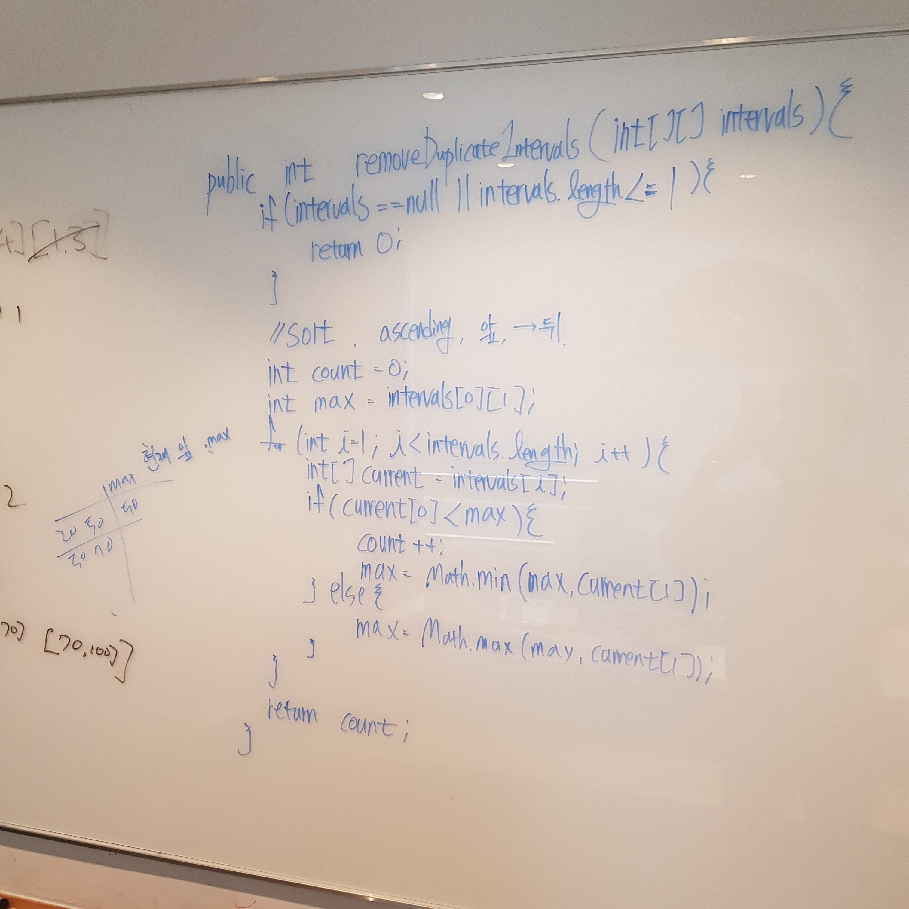

# 435. Non-overlapping Intervals

출제자: Kevin

[Non-overlapping Intervals](https://leetcode.com/problems/non-overlapping-intervals/)

- 출제 이유
  - 바로 전 시간에 스텔라가 Meeting Rooms라는 interval을 사용하는 비스무리한 문제를 냈었는데, 이 문제도 interval 이지만 접근 방식은 완전히 다르다. 두 문제를 준비해 왔지만 **더 헷갈릴 여지를 주기 위해 둘 중 이 문제를 선택했다**.
  - 특별한 자료구조를 사용하지 않는 순수 로직 문제!

---

## Damian


- 처음엔 어떻게 접근해야 할 지 전혀 감을 잡지 못 했다. 사실상 케빈이 힌트를 줘서 문제를 풀 수 있었던 것이나 다름없다.
- 팀원 분이 알고리즘 문제 풀이도 계속 하다보니 하나의 도메인 영역처럼 여겨진다고 하셨었다. 어느 정도 그 말에 공감이 된다. 문제를 풀다 보니 코딩 인터뷰에 어느 정도 유형은 있는 것 같다. interval를 다루는 문제도 그런 것 같다. 구간의 정렬, 겹치는 구간을 어떻게 찾을지, 어떻게 다룰지에 대한 문제가 주로 나오는 것 같다. 무작정 외울 순 없지만 한 번 경험해 본 것은 다음에 빠르게 생각해낼 수 있도록 유형 별 정리를 해둬야 겠다는 생각을 했다.
- 주로 java를 이용해 문제 풀이를 할 텐데 java에서 array를 소팅하는 코드 정도는 외워둬야겠다. 이 경우는 간단한데 primitive array 같은 경우는 오히려 복잡하다. 이런 유틸 성 코드도 정리해 둬야겠다.

```java
public int eraseOverlapIntervals(int[][] intervals) {
    if (intervals == null || intervals.length <= 1) {
        return 0;
    }
    
    Arrays.sort(intervals, (o1, o2) -> {
        int compare = Integer.compare(o1[0], o2[0]);
        if (compare == 0) {
            compare = Integer.compare(o1[1], o2[1]);
        }
        return compare;
    });
    
    int count = 0;
    int max = intervals[0][1];
    for (int i = 1; i < intervals.length; i++) {
        int[] current = intervals[i];
        if (current[0] < max) {
            count++;
            max = Math.min(max, current[1]);
        } else {
            max = current[1];
        }
    }
    return count;
}
```


---

## Kevin

- 데미안이 잘 풀어내서 딱히 더 설명할건 없지만, 요지는 **sorting**을 활용하고 하나씩 돌면서 **end 값을 더 작은 값으로 갱신**해주는 것이다.

```kotlin
fun eraseOverlapIntervals(intervals: Array<IntArray>): Int {
    if (intervals.size <= 1) {
        return 0
    }

    // start 오름차순, end 오름차순으로 정렬
    // 볼때마다 느끼지만 Comparator 코드는 뭔가 보기 불편..
    intervals.sortWith(Comparator { o1, o2 ->
        val diff = o1[0] - o2[0]
        if (diff != 0) {
            diff
        } else {
            o1[1] - o2[1]
        }
    })

    var end = intervals[0][1]
    var removeCount = 0
    for (i in 1 until intervals.size) {
        val nextStart = intervals[i][0]
        val nextEnd = intervals[i][1]
        if (nextStart < end) {
            // 겹치는 구간 발생!
            removeCount += 1

            // 더 작은 end 값으로 갱신해zum
            if (nextEnd < end) {
                end = nextEnd
            }
        } else {
            end = nextEnd
        }
    }

    return removeCount
}
```

- 데미안이 **겹치는 구간 찾기**까지는 잘 생각해냈지만 **최소로 제거할 방법**을 찾는데에는 애를 먹어서 힌트를 살짝 줬는데, 그러니까 그냥 알아서 휙휙 잘 풀어냈다!
- 저번주와 이번주 모두 데미안에게 문제를 냈는데, **데미안이 문제 풀이에 접근해가는 방식이 상당히 체계적이다**. **코드 작성에 바로 돌입하지 않고 생각을 끝까지 정리한 후 작성해 나가는게 풀이자에게도 좋고 면접관의 입장에서도 좋은 것 같다**. 미리 어케 풀어갈지를 알고, 잘못될 부분이 있으면 시간 낭비하지 않고 미리 지적해줄 수 있으니까!
- 시간 배분도 적당했다 ⌛️
